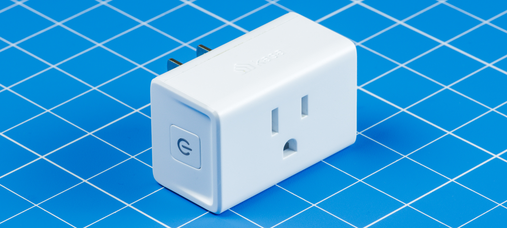

Kasa
===

[](https://www.nuget.org/packages/Kasa/) [](https://github.com/Aldaviva/Kasa/actions/workflows/dotnetpackage.yml) [](https://coveralls.io/github/Aldaviva/Kasa?branch=master)

*Control TP-Link Kasa smart outlets/plugs*

<p><details>
    <summary><strong>Table of Contents</strong></summary>

<!-- MarkdownTOC autolink="true" bracket="round" autoanchor="true" levels="1,2,3,4" bullets="1.,-,-,-" -->

1. [Quick Start](#quick-start)
1. [Prerequisites](#prerequisites)
1. [Installation](#installation)
1. [Configuration](#configuration)
    - [Connections](#connections)
    - [Options](#options)
        - [Logging](#logging)
1. [Commands](#commands)
    - [System](#system)
        - [IsOutletOn](#isoutleton)
        - [SetOutletOn](#setoutleton)
        - [GetName](#getname)
        - [SetName](#setname)
        - [GetInfo](#getinfo)
        - [IsIndicatorLightOn](#isindicatorlighton)
        - [SetIndicatorLightOn](#setindicatorlighton)
        - [Reboot](#reboot)
    - [Time](#time)
        - [GetTime](#gettime)
        - [GetTimeWithZoneOffset](#gettimewithzoneoffset)
        - [GetTimeZones](#gettimezones)
        - [SetTimeZone](#settimezone)
    - [Energy Meter](#energy-meter)
        - [GetInstantaneousPowerUsage](#getinstantaneouspowerusage)
        - [GetDailyEnergyUsage](#getdailyenergyusage)
        - [GetMonthlyEnergyUsage](#getmonthlyenergyusage)
        - [DeleteHistoricalUsage](#deletehistoricalusage)
1. [Exceptions](#exceptions)
1. [References](#references)

<!-- /MarkdownTOC -->
</details></p>



<a id="quick-start"></a>
## Quick Start
```cs
using IKasaOutlet kasa = new KasaOutlet("192.168.1.100");
if (!await kasa.System.IsOutletOn()) {
    await kasa.System.SetOutletOn(true);
}
```

<a id="prerequisites"></a>
## Prerequisites

- A [Kasa smart outlet](https://www.kasasmart.com/us/products/smart-plugs)
    - Verified devices
        - [EP10](https://www.kasasmart.com/us/products/smart-plugs/kasa-smart-plug-mini-ep10)
        - [KP125](https://www.kasasmart.com/us/products/smart-plugs/kasa-smart-plug-slim-energy-monitoring-kp125)
    - Other similar devices may also work if they have the same API, such as the HS103, HS105, KP100, KP115, or EP25
- Any Microsoft .NET runtime that supports [.NET Standard 2.0 or later](https://docs.microsoft.com/en-us/dotnet/standard/net-standard?tabs=net-standard-2-0#net-standard-versions)
    - [.NET 5.0 or later](https://dotnet.microsoft.com/en-us/download/dotnet)
    - [.NET Core 2.0 or later](https://dotnet.microsoft.com/en-us/download/dotnet)
    - [.NET Framework 4.6.1 or later](https://dotnet.microsoft.com/en-us/download/dotnet-framework)

<a id="installation"></a>
## Installation

You can install this library into your project from [NuGet Gallery](https://www.nuget.org/packages/Kasa):
- `dotnet add package Kasa`
- `Install-Package Kasa`
- Go to Project › Manage NuGet Packages in Visual Studio and search for `Kasa`

<a id="configuration"></a>
## Configuration

1. Connect your Kasa device to your wi-fi network.
    - You can do this with the [Kasa Smart app for Android](https://play.google.com/store/apps/details?id=com.tplink.kasa_android) and [iOS](https://apps.apple.com/us/app/kasa-smart/id1034035493).
1. Get your device's hostname.
    - You can find its IP address in your router's client or DHCP lists. The MAC address will match the one printed on the device and shown in Device Info in the Kasa Smart app.
    - You can also scan for servers exposing TCP port 9999.
        ```sh
        nmap --open -pT:9999 192.168.1.0/24
        ```
    - You can also use its FQDN if you assigned one.
1. Construct a new **`KasaOutlet`** instance in your project, passing the device's hostname as a constructor parameter.
    ```cs
    using IKasaOutlet kasa = new KasaOutlet(hostname: "192.168.1.100");
    ```

`IKasaOutlet` instances can be reused to send multiple commands over the lifetime of your application. You can add one to your dependency injection context and retain it for as long as you like. Remember to `Dispose()` it when you're done using it, so that it can tear down the TCP socket.

<a id="connections"></a>
### Connections

The `KasaOutlet` instance will try to transparently handle the TCP connection for you. It will automatically ensure the TCP socket is connected to the Kasa device's server before sending any commands.

If the connection drops, for example if the device reboots, it will automatically attempt to reconnect multiple times before sending the next command, with a delay between attempts. The number of attempts and delay duration can be adjusted using the [options](#options) below.

Optionally, you may manually connect before sending any commands, if you want to connect early to test the connection or ensure lower latency for the first command:

```cs
await kasa.Connect();
```

<a id="options"></a>
### Options

You can customize the `KasaOutlet` instance by setting optional properties to control logging, timeouts, and retries.

```cs
using IKasaOutlet kasa = new KasaOutlet(hostname: "192.168.1.100") {
    LoggerFactory = loggerFactory,
    MaxAttempts = 20,
    RetryDelay = TimeSpan.FromSeconds(1),
    SendTimeout = TimeSpan.FromSeconds(2),
    ReceiveTimeout = TimeSpan.FromSeconds(2)
};
```

<a id="logging"></a>
#### Logging

This library will emit log messages at the `Debug` level when it connects and disconnects from the Kasa device's TCP server. It will also emit `Trace` messages with the raw, stringified JSON objects sent and received on the TCP socket.

[`Microsoft.Extensions.Logging.ILoggerFactory`](https://docs.microsoft.com/en-us/dotnet/core/extensions/logging) instances can be injected from an [ASP.NET Core Builder](https://docs.microsoft.com/en-us/aspnet/core/fundamentals/logging/?view=aspnetcore-6.0) or [.NET Generic Host Builder](https://docs.microsoft.com/en-us/dotnet/core/extensions/generic-host), or [created manually](https://docs.microsoft.com/en-us/dotnet/core/extensions/logging?tabs=command-line#non-host-console-app).

##### ASP.NET Core
```cs
var builder = WebApplication.CreateBuilder(args);
builder.Services.AddSingleton<IKasaOutlet>(services => new KasaOutlet("192.168.1.100") {
    LoggerFactory = services.GetRequiredService<ILoggerFactory>()
});
```

###### appsettings.json
```json
{
  "Logging": {
    "LogLevel": {
      "Default": "Information",
      "Kasa": "Trace"
    }
  }
}
```

##### .NET Generic Host
```cs
Host.CreateDefaultBuilder(args).ConfigureServices(services => {
    services.AddSingleton<IKasaOutlet>(s => new KasaOutlet("192.168.1.100") {
        LoggerFactory = s.GetRequiredService<ILoggerFactory>()
    });
});
```

###### appsettings.json
```json
{
  "Logging": {
    "LogLevel": {
      "Default": "Information",
      "Kasa": "Trace"
    }
  }
}
```

##### Manual
```cs
ILoggerFactory loggerFactory = LoggerFactory.Create(builder => builder
    .AddFilter("Kasa", LogLevel.Trace)
    .AddConsole());

using IKasaOutlet kasa = new KasaOutlet("192.168.1.100") {
    LoggerFactory = loggerFactory
};
```

##### Third-party logging providers
You can also [adapt other logging providers](https://docs.microsoft.com/en-us/dotnet/core/extensions/logging-providers#third-party-logging-providers), such as [NLog](https://github.com/NLog/NLog/wiki/Getting-started-with-.NET-Core-2---Console-application), to consume the logs produced by `KasaOutlet`.

```cs
ConsoleTarget consoleLog = new();
LoggingConfiguration nlogConfig = new();
nlogConfig.AddRule(NLog.LogLevel.Trace, NLog.LogLevel.Fatal, consoleLog);
LogManager.Configuration = nlogConfig;

ILoggerFactory loggerFactory = LoggerFactory.Create(builder => builder
    .ClearProviders()
    .SetMinimumLevel(LogLevel.Trace)
    .AddNLog());

using IKasaOutlet kasa = new KasaOutlet("192.168.1.100") {
    LoggerFactory = loggerFactory,
};
```

<a id="commands"></a>
## Commands

All commands are asynchronous, so you should `await` the returned `Task` to get the result.

More information about each command, including the parameters accepted and data returned, is available in their class and method comments.

<a id="system"></a>
### System

Commands that get or set system properties, like status, name, and whether the outlet is on or off.

<a id="isoutleton"></a>
#### IsOutletOn
Get whether the outlet on the device can supply power to any connected electrical consumers or not.

This is unrelated to whether the entire Kasa device is running. If you can connect to it, it's running.
```cs
bool isOn = await kasa.System.IsOutletOn();
Console.WriteLine($"Is on: {isOn}");
```
```text
Is on: true
```

<a id="setoutleton"></a>
#### SetOutletOn
Turn on or off the device's outlet so it can supply power to any connected electrical consumers or not.

You can also toggle the outlet by pressing the physical button on the device.
This call is idempotent: if you try to turn the outlet on and it's already on, the call will have no effect.

The state is persisted across restarts. If the device loses power, it will restore the previous outlet power state when it turns on again.

This call is unrelated to turning the entire Kasa device on or off. To reboot the device, use [`Reboot`](#reboot).
```cs
await kasa.System.SetOutletOn(true);
```

<a id="getname"></a>
#### GetName
The name or alias of the device that you chose during setup.
```cs
string name = await kasa.System.GetName();
Console.WriteLine("Name: {name}");
```
```text
Name: Washing Machine
```

<a id="setname"></a>
#### SetName
Change the alias of this device. This will appear in the Kasa mobile app.
```cs
await kasa.System.SetName("My Outlet");
```

<a id="getinfo"></a>
#### GetInfo
Get data about the device, including hardware, software, configuration, and current state.
```cs
SystemInfo systemInfo = await kasa.System.GetInfo();
Console.WriteLine($"Operating mode: {systemInfo.OperatingMode}");
Console.WriteLine($"Model name: {systemInfo.ModelName}");
Console.WriteLine($"Model family: {systemInfo.ModelFamily}");
Console.WriteLine($"RSSI: {systemInfo.Rssi}");
Console.WriteLine($"Features: {string.Join(", ", systemInfo.Features)}");
Console.WriteLine($"MAC address: {systemInfo.MacAddress}");
Console.WriteLine($"Device ID: {systemInfo.DeviceId}");
Console.WriteLine($"Updating: {systemInfo.Updating}");
Console.WriteLine($"Software version: {systemInfo.SoftwareVersion}");
Console.WriteLine($"Hardware version: {systemInfo.HardwareVersion}");
Console.WriteLine($"Hardware ID: {systemInfo.HardwareId}");
Console.WriteLine($"OEM ID: {systemInfo.OemId}");
```
```text
Operating mode: Schedule
Model name: EP10(US)
Model family: Smart Wi-Fi Plug Mini
RSSI: -49
Features: Timer
MAC address: 5CA6E64EF3EF
Device ID: 8006C153CFEBDE93CD3572549B5A47611F49F0D2
Updating: False
Software version: 1.0.2 Build 200915 Rel.085940
Hardware version: 1.0
Hardware ID: AE6865C67F6A54B756C0B5812472C825
OEM ID: 41372DE62C896B2C0E93C20D70B62DDB
```

<a id="isindicatorlighton"></a>
#### IsIndicatorLightOn
Outlets have a physical status light that shows whether they are supplying power to consumers or not.

This light can be disabled even when the outlet is on, for example if it's annoyingly bright in a room where you're trying to watch a movie or go to sleep.
```cs
bool isIndicatorLightOn = await kasa.System.IsIndicatorLightOn();
Console.WriteLine($"Is indicator light on: {isIndicatorLightOn}");
```
```text
Is indicator light on: true
```

<a id="setindicatorlighton"></a>
#### SetIndicatorLightOn
Outlets have a physical status light that shows whether they are supplying power to consumers or not.

This light can be disabled even when the outlet is on, for example if it's annoyingly bright in a room where you're trying to watch a movie or go to sleep.
```cs
await kasa.System.SetIndicatorLightOn(true);
```

<a id="reboot"></a>
#### Reboot
Restart the device.

Rebooting will interrupt power to any connected consumers for roughly 108 milliseconds.
It takes about 8 seconds for a KP125 to completely reboot and resume responding to API requests, and about 14 seconds for an EP10.

The existing outlet power state will be retained after rebooting, so if it was on before rebooting, it will turn on again after rebooting, and there is no need to explicitly call [`SetOutletOn`](#setoutleton) to reestablish the previous state.

By default, this client will automatically reconnect to the outlet after it reboots, which can be tuned using the [`MaxAttempts`](#options) and [`RetryDelay`](#options) properties.
```cs
await kasa.System.Reboot(TimeSpan.FromSeconds(5));
```

<a id="time"></a>
### Time

Commands that deal with the device's internal clock that keeps track of the current date and time. This is unrelated to schedules and timers that control when the outlet turns on or off.

<a id="gettime"></a>
#### GetTime
Get the current local time from the device's internal clock.
```cs
DateTime time = await kasa.Time.GetTime();
Console.WriteLine($"Device time: {time:F}");
```
```text
Device time: Saturday, June 11, 2022 3:48:21 am
```

<a id="gettimewithzoneoffset"></a>
#### GetTimeWithZoneOffset
Get the current time and time zone from the device's internal clock.
```cs
DateTimeOffset dateTime = await kasa.Time.GetTimeWithZoneOffset();
Console.WriteLine($"Device time: {dateTime:O}");
```
```text
Device time: 2022-06-11T03:56:03.0000000-07:00
```

<a id="gettimezones"></a>
#### GetTimeZones
Get a list of possible time zones that the device is in.

This may return multiple possibilities instead of one time zone because, unfortunately, Kasa devices internally represent multiple time zones with non-unique identifiers.
For example, `Central Standard Time` is unambiguously stored as `13` on the Kasa device, so this method will only return that time zone.

However, `Eastern Standard Time` is stored as `18` on the Kasa device, which collides with `18` that it also uses to represent `Eastern Standard Time (Mexico)`, `Turks and Caicos Standard Time`, `Haiti Standard Time`, and `Easter Island Standard Time`, so this method will return all five possibilities since they cannot be distinguished based on the information provided by the device.
```cs
IEnumerable<TimeZoneInfo> timeZones = await kasa.Time.GetTimeZones();
Console.WriteLine($"Device time zone may be {string.Join(" or ", timeZones.Select(zone => zone.Id))}");
```
```text
Device time zone may be Yukon Standard Time or Pacific Standard Time
```

<a id="settimezone"></a>
#### SetTimeZone
Configure the device to use a specific time zone.
```cs
await kasa.Time.SetTimeZone(TimeZoneInfo.Local);
```

<a id="energy-meter"></a>
### Energy Meter
Commands that deal with the energy meter present in some Kasa devices, such as the KP125 and KP115.

To determine if your device has an energy meter, you can call `(await kasaOutlet.System.GetInfo()).Features.Contains(Feature.EnergyMeter)`.

<a id="getinstantaneouspowerusage"></a>
#### GetInstantaneousPowerUsage
Fetch a point-in-time measurement of the instantaneous electrical usage of the outlet.
```cs
PowerUsage usage = await kasa.EnergyMeter.GetInstantaneousPowerUsage();
Console.WriteLine($"Attached consumer is currently using {usage.Current:N0} mA, {usage.Voltage / 1000.0:N3} V, and {usage.Power:N0} mW.");
Console.WriteLine($"It has used {usage.CumulativeEnergySinceBoot / 1000.0:N3} kWh since the Kasa device last booted.");
```
```text
Attached consumer is currently using 0 mA, 123.069 V, and 0 mW.
It has used 0.433 kWh since the Kasa device last booted.
```

<a id="getdailyenergyusage"></a>
#### GetDailyEnergyUsage
Fetch a historical report of cumulative energy usage, grouped by day, from a given month and year.
```cs
DateTimeOffset now = DateTimeOffset.Now;
if (await kasa.EnergyMeter.GetDailyEnergyUsage(now.Year, now.Month) is { } days) {
    int monthStart = (int) new DateTime(now.Year, now.Month, 1).DayOfWeek;
    Console.Write(string.Join(null, Enumerable.Repeat("           | ", monthStart)));
    for (int day = 0; day < days.Count; day++) {
        int      usage = days[day];
        DateTime date  = new(now.Year, now.Month, day + 1);
        Console.Write($"{date:dd}: {usage,3:N0} Wh{(day % 7 == monthStart ? "\n" : " | ")}");
    }
}
```
```text
           |            |            | 01:   0 Wh | 02:  22 Wh | 03: 182 Wh | 04:  10 Wh
05: 181 Wh | 06:   7 Wh | 07:   8 Wh | 08:   7 Wh | 09:   7 Wh | 10:   8 Wh | 11:   1 Wh
12:   0 Wh | 13:   0 Wh | 14:   0 Wh | 15:   0 Wh | 16:   0 Wh | 17:   0 Wh | 18:   0 Wh
19:   0 Wh | 20:   0 Wh | 21:   0 Wh | 22:   0 Wh | 23:   0 Wh | 24:   0 Wh | 25:   0 Wh
26:   0 Wh | 27:   0 Wh | 28:   0 Wh | 29:   0 Wh | 30:   0 Wh |
```

<a id="getmonthlyenergyusage"></a>
#### GetMonthlyEnergyUsage
Fetch a historical report of cumulative energy usage, grouped by month, from a given year.
```cs
DateTimeOffset now = DateTimeOffset.Now;
if (await kasa.EnergyMeter.GetMonthlyEnergyUsage(now.Year) is { } months) {
    for (int month = 0; month < 12; month++) {
        int      usage = months[month];
        DateTime date  = new(now.Year, month + 1, 1);
        Console.Write($"{date:MM}: {usage,3:N0} Wh{(month % 3 == 2 ? "\n" : " | ")}");
    }
}
```
```text
01:   0 Wh | 02:   0 Wh | 03:   0 Wh
04:   0 Wh | 05:   0 Wh | 06: 433 Wh
07:   0 Wh | 08:   0 Wh | 09:   0 Wh
10:   0 Wh | 11:   0 Wh | 12:   0 Wh
```

<a id="deletehistoricalusage"></a>
#### DeleteHistoricalUsage
Clear all energy usage data for all days, months, and years, and begin gathering new data from a fresh start.

After calling this method, subsequent calls to [`GetDailyEnergyUsage`](#getdailyenergyusage) and [`GetMonthlyEnergyUsage`](#getmonthlyenergyusage) will return `null` for past months and years, respectively. The current month and year's data will be reset to `0`, respectively. In addition, subsequent calls to [`GetInstantaneousPowerUsage`](#getinstantaneouspowerusage) will return `0` for `CumulativeEnergySinceBoot`, although it will not affect the point-in-time, non-historical measurements `Current`, `Voltage`, and `Power`.
```cs
await kasa.EnergyMeter.DeleteHistoricalUsage();
```

<a id="exceptions"></a>
## Exceptions

All known exceptions thrown by this library are documented in the comments of each method.

Each command can throw two main exceptions:
- **`NetworkException`** if the TCP socket connection failed and could not be automatically recovered. Check the inner `SocketException` or `IOException` for the cause.
- **`ResponseParsingException`** if the TCP server returned JSON that could not be deserialized, possibly because the API changed or the device is unsupported.

Some methods also throw other exceptions in specific cases, such as `ArgumentOutOfRangeException` or `TimeZoneNotFoundException`.

<a id="references"></a>
## References
- [tplink-smarthome-commands.txt](https://github.com/softScheck/tplink-smartplug/blob/master/tplink-smarthome-commands.txt) — *Lubomir Stroetmann and Tobias Esser*
- [Reverse Engineering the TP-Link HS110](https://www.softscheck.com/en/reverse-engineering-tp-link-hs110/) — *Lubomir Stroetmann and Tobias Esser*
- [Controlling the TP-LINK HS100 Wi-Fi smart plug](https://blog.georgovassilis.com/2016/05/07/controlling-the-tp-link-hs100-wi-fi-smart-plug/) — *George Georgovassilis, Thomas Baust*
- [python-kasa](https://github.com/python-kasa/python-kasa)
- [Pi Projects](https://morepablo.com/2022/04/household-pi-projects.html) — *Pablo Meier*
- [THLaundry](http://thlaundry.techhouse.org) — *Ben Hutchison, Robert Mustacchi*
- [homebridge-tplink-smarthome#202](https://github.com/plasticrake/homebridge-tplink-smarthome/issues/202) — *the1maximus*
- [KasaLink](https://github.com/mguinness/KasaLink/blob/main/KasaLink/Program.cs) — *mguinness*
- [kasasock](https://github.com/english299/Smart-Home-Without-the-Cloud/blob/main/kasaHS1xx/csharp/kasasock.cs) — *Brian English*
- [Home Assistant](https://www.home-assistant.io/integrations/tplink)
- [tplink-smarthome-simulator](https://github.com/plasticrake/tplink-smarthome-simulator) — *Patrick Seal*
